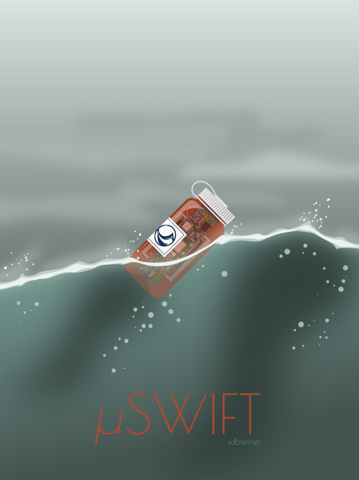

# microSWIFT

Operational code for the microSWIFT v1 wave buoy developed at the University of Washington Applied Physics Laboratory (UW-APL).

Learn more about the microSWIFT wave buoy:
https://apl.uw.edu/project/projects/swift/pdfs/microSWIFTspecsheet.pdf (spec sheet)

Data access: 
microSWIFT wave measurements in the form of spectral and bulk parameters are telemetered to the SWIFT server:
- http://faculty.washington.edu/jmt3rd/SWIFTdata/DynamicDataLinks.html (web page)
- https://swiftserver.apl.washington.edu/map/ (map)
- https://github.com/SASlabgroup/microSWIFTtelemetry (Python-based data access)

Raw data in the form of GPS and IMU time series is stored in the onboard SD card in the `microSWIFT/data/` directory.

