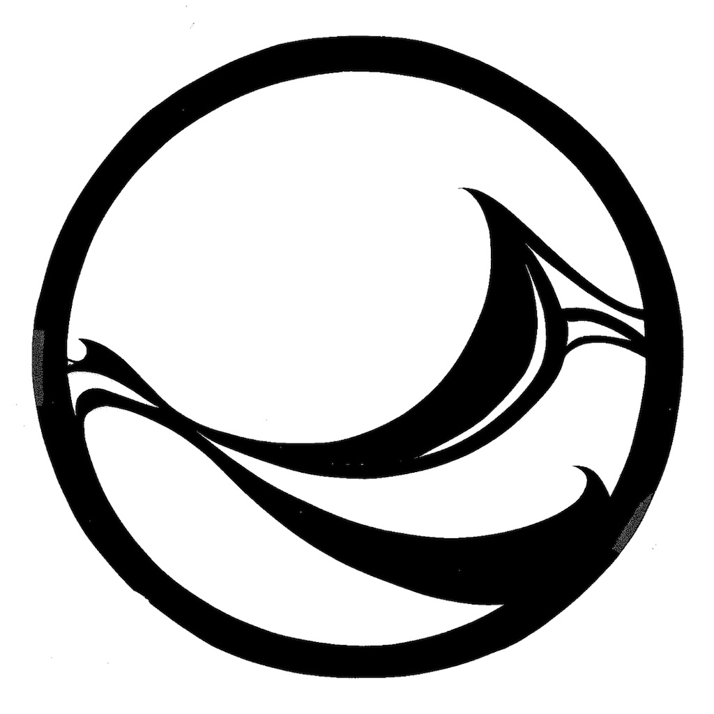

[](https://github.com/SASlabgroup/microSWIFT/actions/workflows/python-package-conda.yml)

# </img>microSWIFT v1

Operational code for the microSWIFT v1 wave buoy developed at the University of Washington Applied Physics Laboratory (UW-APL).

## About microSWIFT

</img>

MicroSWIFT is an expendable version of the [Surface Wave Instrument Float with Tracking](https://apl.uw.edu/project/project.php?id=swift) (SWIFT) platform. Original development of the microSWIFT buoy (now v1) began in 2020, led by engineers at the University of Washington Applied Physics Laboratory (UW-APL). It is built around a Raspberry Pi and runs operational code written in Python (this repository). This combination of developer-friendly hardware and easy-to-read code has fostered the creation of an effective tool for ocean wave research and student learning. This version of the microSWIFT continues to be developed and improved, and has been used to study breaking waves in nearshore environments, hurricanes, waves in sea ice, and more.

## Requirements
(e.g. need a raspberry pi microSWIFT...!)
Hardware
Python version

## Installation
How to load onto a raspberry pi

## Usage
### Configuration
e.g. config file use

### Data access: 
microSWIFT wave measurements in the form of spectral and bulk parameters are telemetered to the SWIFT server:
- http://faculty.washington.edu/jmt3rd/SWIFTdata/DynamicDataLinks.html (web page)
- https://swiftserver.apl.washington.edu/map/ (map)
- https://github.com/SASlabgroup/microSWIFTtelemetry (Python-based data access)

Raw data in the form of GPS and IMU time series is stored on the onboard SD card in `.dat` format in the `microSWIFT/data/` directory.


### Repository Structure

```
microSWIFT/
├── LICENSE
├── README.md
├── doc
│   ├── Design.md
│   └── images
│       └── microSWIFT.png
├── environment.yml
├── examples
│   └── examples.ipynb
└── microSWIFT
    ├── __init__.py
    ├── accoutrements
    │   ├── __init__.py
    │   ├── adafruit_fxas21002c.py
    │   ├── adafruit_fxos8700.py
    │   ├── gps_module.py
    │   ├── imu_module.py
    │   ├── imu_checkout.py
    │   ├── sbd.py
    │   └── telemetry_stack.py
    ├── mocks
        ├── __init__.py
        ├── mock_adafruit_fxas21002c.py
        ├── mock_adafruit_fxos8700.py
        ├── mock_board.py
        ├── mock_busio.py
        ├── mock_rpi_gpio.py
    ├── checkout.py
    ├── config.txt
    ├── microSWIFT.py
    ├── processing
    │   ├── __init__.py
    │   ├── collate_imu_and_gps.py
    │   ├── gps_waves.py
    │   ├── integrate_imu.py
    │   ├── transform_imu.py
    │   └── uvza_waves.py
    ├── tests
    │   ├── __init__.py
    │   ├── test_checkout.py
    │   ├── test_configuration.py
    │   ├── test_data
    │   │   └── config_files
    │   ├── test_imu_checkout.py
    │   └── test_microSWIFT.py
    └── utils
        ├── __init__.py
        ├── configuration.py
        ├── log.py
        ├── microSWIFT.service
        ├── pylint.txt
        ├── setup.bash
        └── utils.py
```

### Contributions

### Acknowledgements
