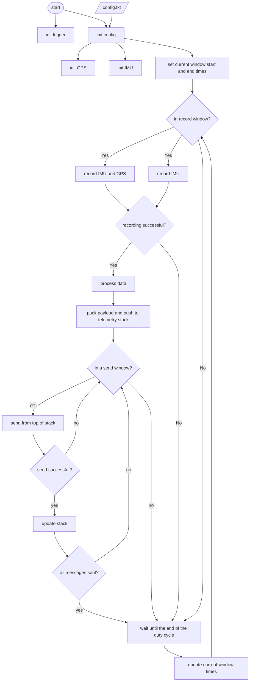
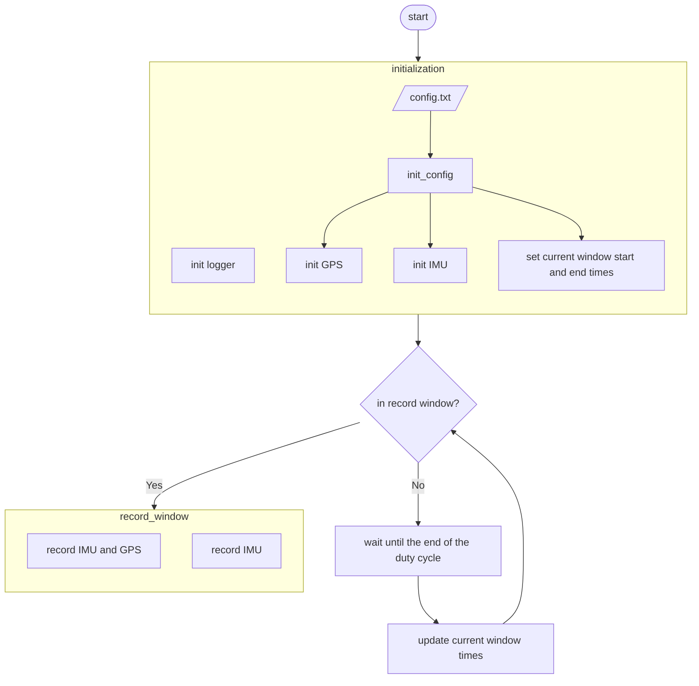
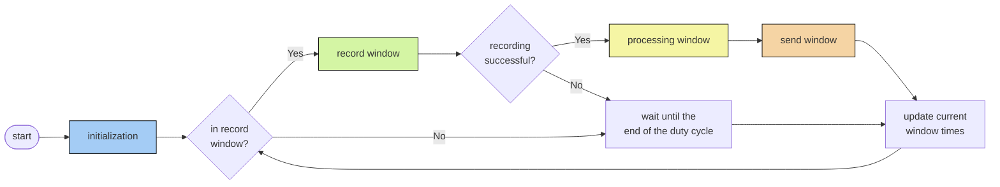
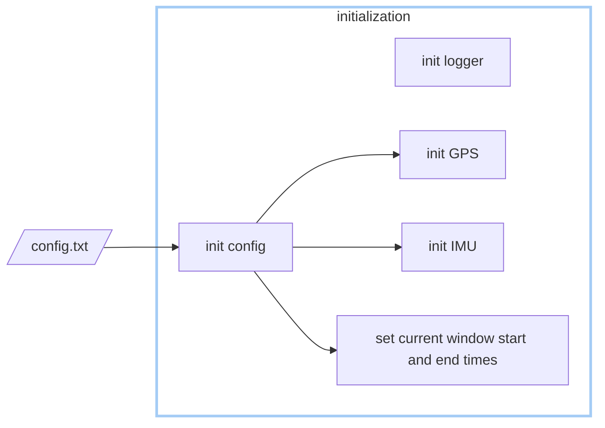
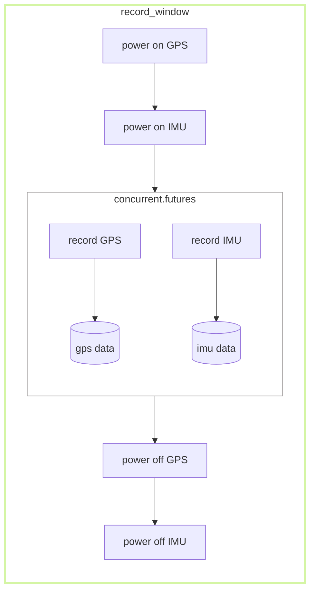
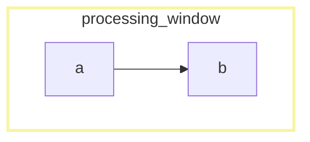
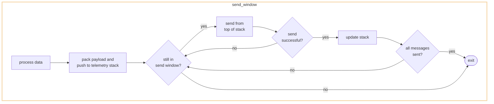

# microSWIFT Design

## Users and Use Cases

### Researchers: Want to deploy the microSWIFT and change settings

A researcher would like to be able to quickly and easily install the microSWIFT software on a buoy with the appropriate hardware so that they may collect data. The researcher also would like to have a high degree of confidence that all of the sensors are working correctly before deployment. Finally, the researcher would like an easy way to configure setting regarding data collection and data transmission. The researcher has a high level of domain expertice but likely only a medium-level of technical competency.

Use Cases:

* Install microSWIFT software on newly built buoy
* Run diagnostic test on sensors and transmission unit
* Based on diagnostic tests, know if a sensor is working or not
* Configure sensor and transmission settings

### Technicians: Wants to build the microSWIFT

The technician is the user who actually built the physical buoy. The technician needs to be able to know whether or not the sensors have been installed correctly and receive detailed diagnostic information if they are not. The technician has a high technical competency (on both the hardware and software side) but wouldn't necessarily be a domain expert.

* Individual sensor testing
* Full system diagnostics
* Fully configure system

### Developers: Wants to add features to the microSWIFT (software and hardware)

Able to read documentation and add features.

## Components

### Sensor Loggers
* Receive and store data for:
	* GPS
	* IMU

### Data store
* Data store for raw text data

### Data processor
* Functions to process raw text data

### Sensor Testers
* Functions to fully test functionality of sensors and sensor loggers

### Transmission Unit Tester
* Functions to test functionality of transmission unit

### Configuration UI
* Functions to ingest user set configurations for sensor and transmission functionality

## Design Diagram 
This is an example of using the mermaid diagram tool 

---

Main process flow controlled by `microSWIFT.py`:

Details of the initialization:

Record window:

Processing window:

Send window:

