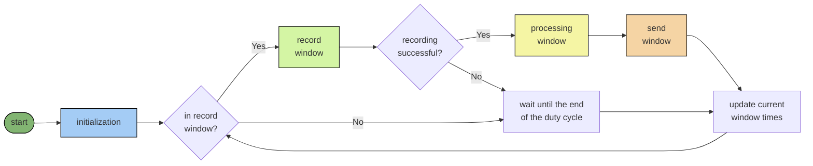
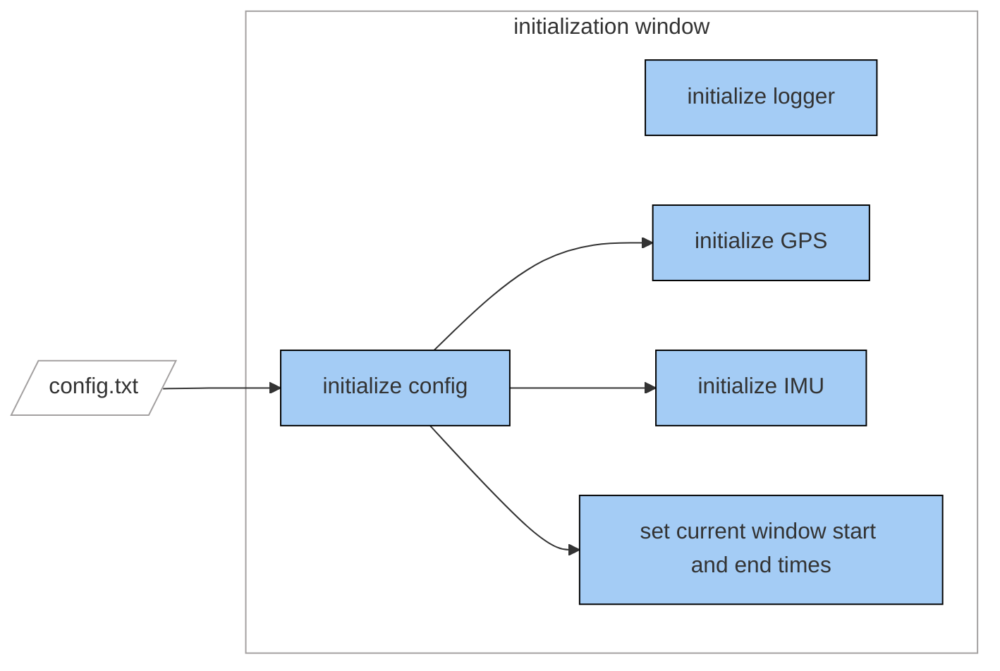
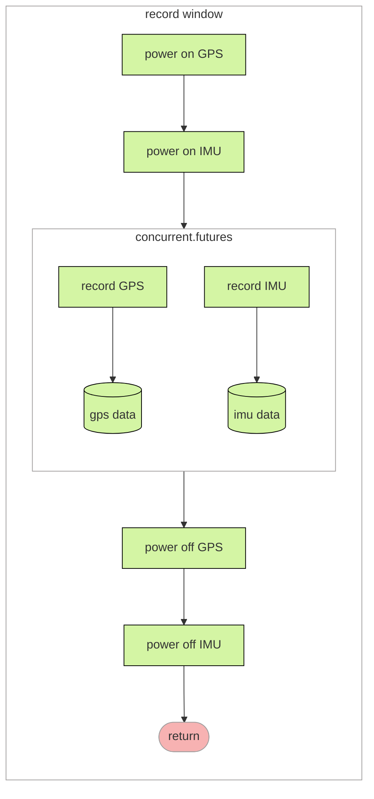
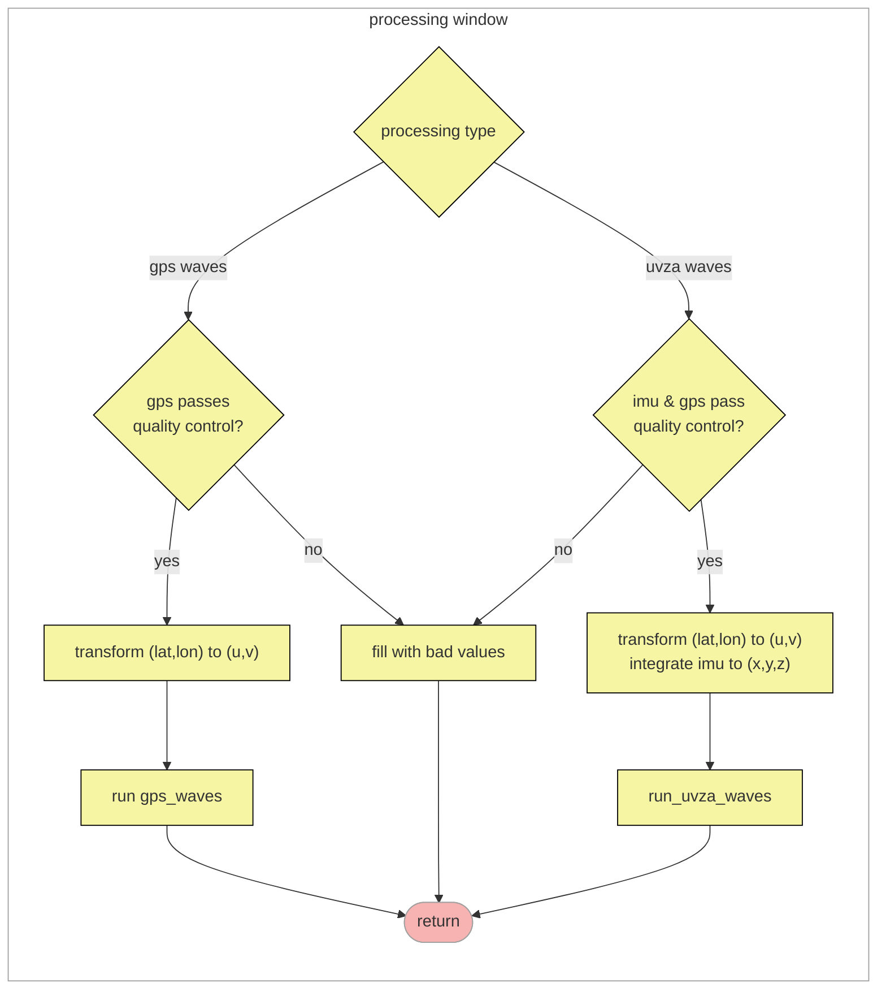
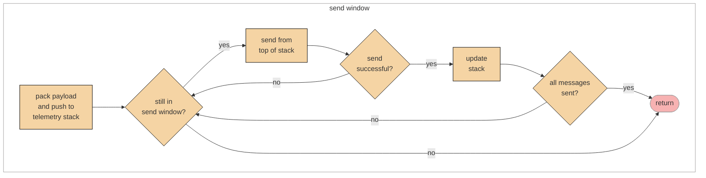

# Component Specification

Specifications for microSWIFT v1 can be found here:
https://apl.uw.edu/project/projects/swift/pdfs/microSWIFTspecsheet.pdf (spec sheet)

## Hardware Components

</img>

### Raspberry Pi

At the heart of the microSWIFT is a Raspberry Pi Zero. This developer-friendly board, combined with easy-to-read Python-based code, makes the microSWIFT an effective tool for ocean wave research and student learning. An obvious tradeoff, however, is its high power consumption compared to that attainable with an embedded microcontroller and code.

### GPS

The GPS module is a GlobalTop FGPMMOPA6H provided on an Adafruit Ultimate GPS v3 breakout board. It provides the time, position, and velocity  datastreams to the microSWIFT. The last known position of the microSWIFT is reported to the server during every duty cycle as latitude and longitude in decimal degrees. The North and East doppler velocities are fundamental input to the onboard wave processing algorithms.

### IMU

The inertial measurement unit (IMU) is comprised of a 3-axis digital gyroscope (FXAS21002C) and a 6-axis integrated linear accelerometer and magnetometer (FXOS8700CQ), both provided on an Adafruit Precision NXP 9-DOF Breakout Board. The combined IMU measurements can be transformed, numerically integrated, and used to provide an alternative heave estimate in the wave processing.

### Iridium Modem
MicroSWIFT data is telemetered over the Iridium network using a RockBLOCK 9603 module/modem. Note that there is a monthly rental service to exchange information with the Iridium satellite network.

## Software Components
TODO: many of these can be adapted from the code comments/docstrss

### microSWIFT.py

The main operational script that runs on the microSWIFT V1 wave buoys. This script sequences the microSWIFT data collection, post-processing, and telemetering. Its core task is to schedule these events, ensuring
that the buoy is in the appropriate record or send window based on the user-defined settings.

The process flow is summarized as follows:
    1. Record GPS and record IMU concurrently; write to .dat files
    2. Read the raw data into memory and process it into a wave solution
    3. Create a payload and pack it into an .sbd message; telemeter the
       message to the SWIFT server.

### Config class
Description: Class object for configuration of the microSWIFT.

#### Attributes
##### Timing 
DUTY_CYCLES_PER_HOUR = int(60/duty_cycle_length)
DUTY_CYCLE_LENGTH = timedelta(minutes=duty_cycle_length)
RECORD_WINDOW_LENGTH = timedelta(minutes=record_window_length)
START_TIME = self.get_start_time()
END_RECORD_TIME = self.START_TIME + self.RECORD_WINDOW_LENGTH
END_DUTY_CYCLE_TIME = self.START_TIME + self.DUTY_CYCLE_LENGTH

##### System
ID = os.uname()[1]
PAYLOAD_TYPE = 7
SENSOR_TYPE = 52
DATA_DIR = './data/'

##### GPS
GPS_SAMPLING_FREQ = gps_sampling_frequency
GPS_GPIO = 21
GPS_PORT = '/dev/ttyS0'
START_BAUD = 9600
BAUD = 115200

##### IMU
IMU_SAMPLING_FREQ = imu_sampling_frequency
IMU_GPIO = 20

##### Data
WAVE_PROCESSING_TYPE = 'gps_waves'
BAD_VALUE = 999
NUM_COEF = 42

#### Methods:
read_config_file(config_fname)
get_start_time()
update_times()

### GPS class
Description: Class object for the GPS component on the RPi.

#### Attributes
initialized
powered_on
gps_freq = config.GPS_SAMPLING_FREQ
gps_gpio = config.GPS_GPIO
dataDir = config.DATA_DIR
gps_port = config.GPS_PORT
start_baud = config.START_BAUD
baud = config.BAUD
gpgga_found
gprmc_found

#### Methods
power on()
power off()
checkout(ser)
record(end_time)
to_uvz(gps_file)

### IMU class
Description: Class object for the IMU component on the RPi.

#### Attributes
initialized
imuFreq = config.IMU_SAMPLING_FREQ
imu_samples = config.IMU_SAMPLING_FREQ * config.RECORD_WINDOW_LENGTH.total_seconds()
imu_gpio = config.IMU_GPIO
dataDir = config.DATA_DIR

#### Methods
power_on()
power_off()
record(end_time)
checkout(run_time)
sec(n_secs)
datetimearray2relativetime(datetimeArr)
RCfilter(b, fc, fs)
to_xyz(imufile, fs)

### Wave processing algorithms
(TODO: `gps_waves`, `uvza_waves` descriptions)

### SBD class
(TODO: description of class, its methods, and attributes)

### Telemetry stack
(TODO: description)

## Design Diagram

Process flow is controlled by `microSWIFT.py` module. At boot-up, `microSWIFT.py` is executed by `microSWIFT.service`. It then instantiates the `logger`, `Config`, `GPS`, and `IMU` objects and enters the record-process-send loop which runs indefinitely. Each loop is defined as one duty cycle. This is sequencing is summarized in the following flow chart:

### Initialization window

The initialization window is run once per boot. It instantiates  `logger`, `Config`, `GPS`, and `IMU` objects based on the user-defined configuration settings in `config.txt`. It also sets the defining window times, including the start of the duty cyle (= start of the `record window`), the end of the recording window, and the end of the duty cycle (note that the length of `send window` = a full duty cycle - `record window`).

### Record window

A record window is entered when the current time is between the start and end record window times, as determined by `Config`. Its main task is to power on the GPS and IMU, record them concurrently using `concurrent.futures`, and then power them down. The `record()` method of both `GPS` and `IMU` writes data to `.dat` files stored onboard.

### Processing window

The processing window reads the previously recorded `.dat` files from the `GPS` and `IMU`  into memory, transforms the data into the appropriate coordinates, and produces a wave estimate based on the configured wave processing type. If the required data streams do not pass quality control, the payload is filled with bad values to be sent along with any remaining available data.

### Send window

In the send window, the payload is packed into a binary short burst data (`.sbd`) file and pushed onto a stack of messages to be sent. Until the duty cycle is up, or if the stack empties, messages are repeatedly read from the top of the stack and sent to the server. If a message fails to send, the loop continues to try to send it until the time expires.

